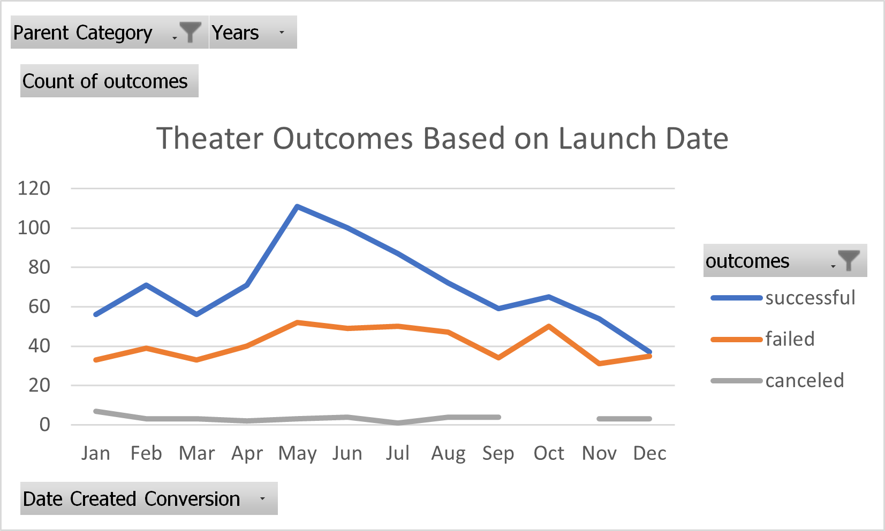
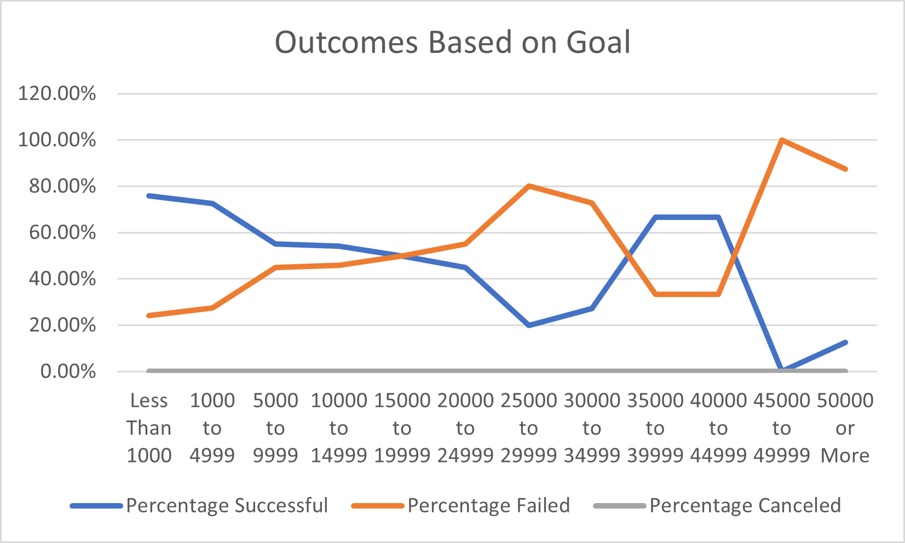

# Kickstarting with Excel
## Overview of Project
Louise wants to start a crowdfunding campaign to help fund her play, “Fever.”  Excel can help analyze crowdfunding data to determine what factors make a campaign successful, failed, or canceled.  To assist Louise’s decision making, theater and play production outcomes were assessed based on their launch dates and funding goals.  
## Analysis and Challenges
### Analysis of Outcomes Based on Launch Date

A [pivot table](https://support.microsoft.com/en-us/office/create-a-pivottable-to-analyze-worksheet-data-a9a84538-bfe9-40a9-a8e9-f99134456576) and line chart were created to visualize the relationship between launch month and theater outcomes.  For the pivot table, the following fields were selected: "Parent Category" and "Years" for filters, "outcomes" for columns, "Date Created Conversion" for rows, and "Count of outcomes" for values.

### Analysis of Outcomes Based on Goals
The [COUNTIFS](https://support.microsoft.com/en-us/office/countif-function-e0de10c6-f885-4e71-abb4-1f464816df34)
 function was used to collect outcome and goal data for plays.  This data was then used to visualize the percentage of successful, failed, and canceled plays based on funding goal amount of different dollar-amount ranges through a line chart.

### Challenges and Difficulties Encountered
Although no challenges were encountered, creating a pivot table may be unfamiliar for others especially when it comes to selecting the appropriate filter, volumn, row, and value fields.

## Results
- What are two conclusions you can draw about the Outcomes based on Launch Date? According to the “Theater Outcomes Based on Launch Date” line chart, the month of May had the most success with 111 theater campaigns.  After the month of May, there is a steep decline in successful plays in which December had the lowest success with only 37 theater campaigns.  

- What can you conclude about the Outcomes based on Goals?
The “Outcomes Based on Goal” line chart indicates that about 75.81% of plays were successful with a goal of less than $1000. This goal range had the highest success rate for plays.  It is also noted that no plays were successful with a goal of $45000 to $49999.
- What are some limitations of this dataset?
The kickstarter dataset is from 2009 to 2017. Having more recent data could help assess current trends.

- What are some other possible tables and/or graphs that we could create?
Another table and line chart showing theater outcomes based on the country may also be beneficial since success may vary between different geographics.  
